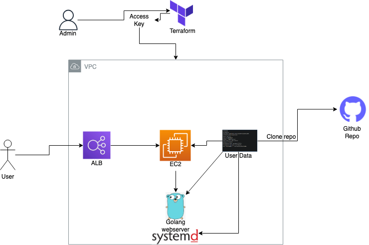
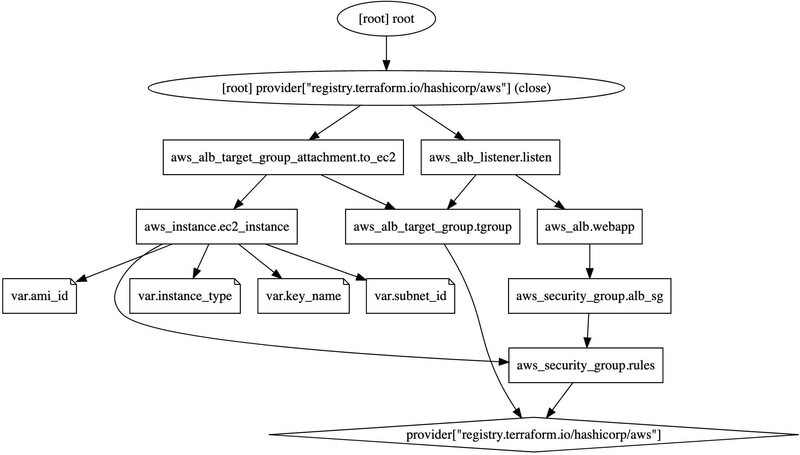

# AWS ELB/ALB Golang Application
## ___Golang Web application behind an AWS Application load balancer___
## Tools | Terraform | ELB | ALB | EC2 | EC2 User Data | AWS Security Groups | AWS Target Groups | Systemd | Golang

### ___Overview___
* EC2 instances creation `aws_instance.ec2_instance` with the relevant variables `var.instance_type` `var.key_name` `var.subnet_id` + security group `aws_security_group.rules` with ports 80/22 is initialized.
* an application load balancer resource `aws_alb.webapp` is created with listener on port 80
* a target group is created `aws_alb_target_group.tgroup` to point the ALB to the relevant ec2 instances 
* an attachment of the target group between the ALB and the instances occours using `aws_alb_target_group_attachment.to_ec2`
* an additional security group for the loadbalancer resources is also created to allow inbound & outbound traffic `aws_security_group.alb_sg`
###  ___A Golang webserver is deployed on ec2 instances___
  1. In this project i utilized ec2 user data capabilities with a custom script in order to deploy the Go Webserver with systemd.
  2. the custom script clones this repo & compiles the golang application & creates and executes a systemd service which listens on port 80

### ___This project utilizes Terraform in order to deploy AWS resources___
  1. all relevant .tf files to deploy the necessary ELB and webserver are included
  2. Terraform deployment visualization :  

## Architecture 
    

## TF Graph 
  
